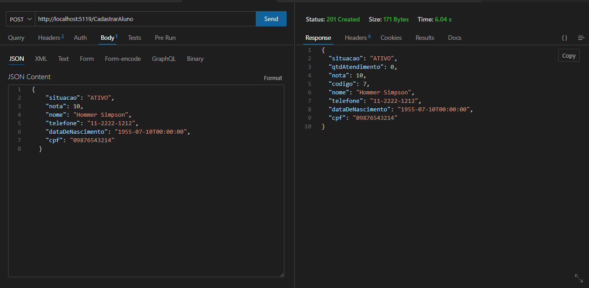
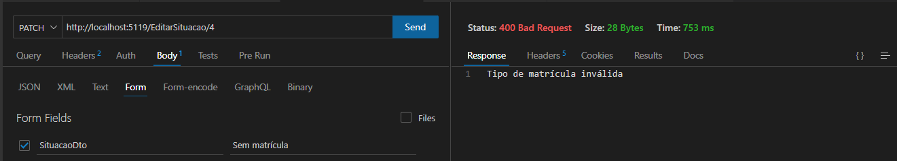
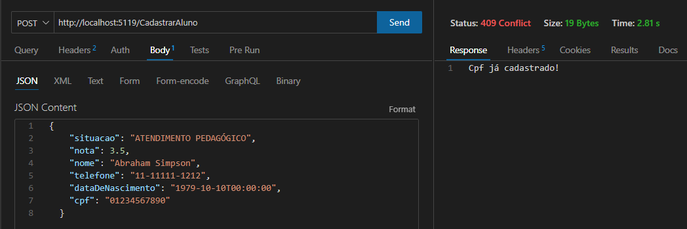
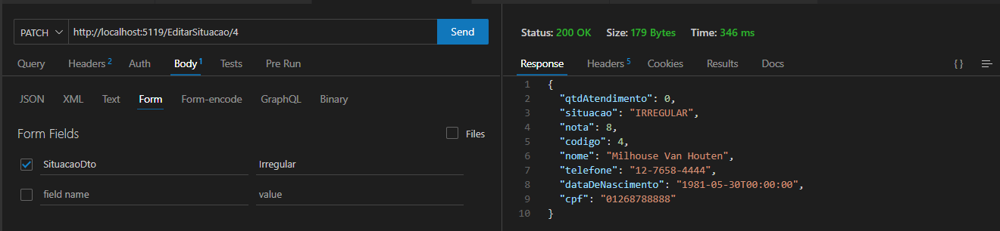
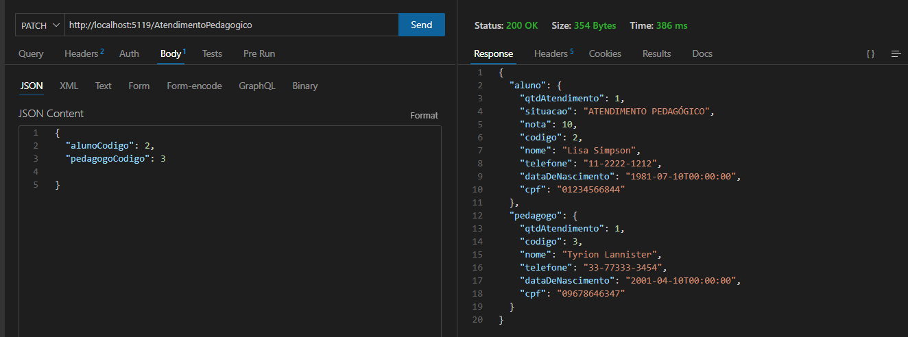
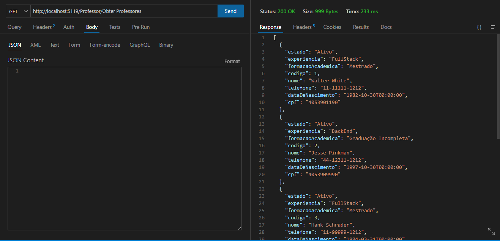
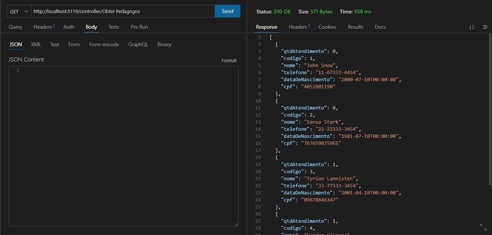

# Projeto Módulo 1 FullStack Floripa + Tec

Projeto desenvolvido em C# com .Net

## Ferramentas necessárias para uso do projeto:

  - VSCode ou Visual Studio
  - Postman, Insomnia ou Thunder Client(Extensão do VSCode)
  - SQL Server
  - Google Chrome

## Funcionalidade da aplicação
Com a aplicação é possível fazer um crud da entidade Alunos e a seleção das outras categoarias.

## Como usar a aplicação

- No VSCode abra o terminal e digite: dotnet run 
- Inicie a aplicação
- Na ferramenta de banco de dados verifique se foram criadas as tabelas
- No Postman ou no Swagger execute os endpoints
- Retorne ao SQL Server e veja os resultados da manipulação obtida com os endpoints
  
## Projeto documentado com a ferramenta Swagger.
O projeto pode ser executado com a ferramenta de documentação:   
 [Swagger](http://localhost:5119/swagger/index.html), desde que a aplicação  esteja rodando

## Exemplos de execução na ferramenta Thunder Client

### Exemplo de como cadastrar um Aluno:
### Método POST

### Exemplo de como cadastrar um Aluno:
### Método POST
### A categoria deve ser cadastrada como: Ativo, Inativo ou Irregular

### Exemplo de como cadastrar Alunos:
### Método POST
### O CPF deve ser único

### Exemplo de como exibir a entidade Alunos:
### Método GET

### Exemplo de como encontrar um Aluno pelo código:
### Método GET

### Exemplo de como deletar um Aluno:
### Método DELETE

### Exemplo de como editar a situação de Aluno:
### Método PATCH

### Exemplo de como cadastrar um atendimento pedagógico:
### Método POST

### Exemplo de como visualizar Professores:
### Método GET

### Exemplo de como visualizar Pedagogos:
### Método GET

### Produzido por Emanuel Lopes
## Aluno  Senai

